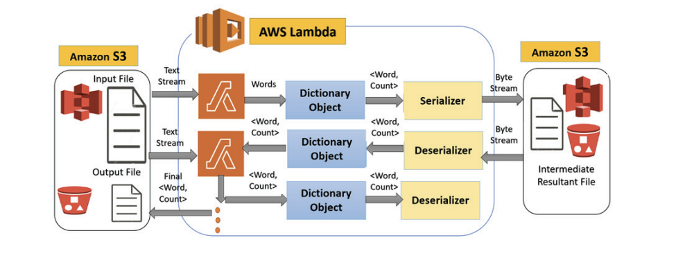

# A Scalable Design Approach for State Propagation in Serverless Workflow

This project contains an implementation of the design proposed in the paper 'A Scalable Design Approach for State Propagation in Serverless Workflow'. The implementation is done using python.

The proposed application design approach is in which a sequence of FaaS instances can store and share the intermediate data in an efficient way. This approach involves breaking down a large computation into small, independent functions that can be executed on a serverless platform. These functions communicate by serializing and deserializing intermediate data, which is stored in a cloud object storage service as files. Multiple Function Instances work on the MapReduce programming model, to find the final WordCount of an input English text file. 

The implemented design uses a parameter, called SafeSize, that is, the maximum number of bytes that can be processed by a single serverless function before it times out. This parameter ensures that a function is never terminated abruptly by the service provider. Termination of a function in between leaves the intermediate state hanging and inconsistent, which isn’t desirable.

The design approach makes use of the advanced features and library modules of a programming language to handle the ephemeral data of a FaaS instance as a byte stream.

 
The design uses object serialization/deserialization with cloud object storage to share state across functions. It provides a mechanism for fine-grained support for state propagation and
synchronization in a serverless workflow. This solution is cost effective and efficient as it does not depend on any external database or cache for state management. The design has been validated by implementing ‘Word Count’- a classic MapReduce use case. 

In comparison to other popular programming languages, Python offers the most flexible serialization and deserialization of objects. Hence, python has been used for the implementation of the mapReduce algorithm for getting the word count of an input file. The Pickle module is used for serialization and deserialization.

## Team members:
 - Nanda Kishore - 191CS140
 - K Dharmick Sai - 191CS221
 - Aryaman M - 191CS211
